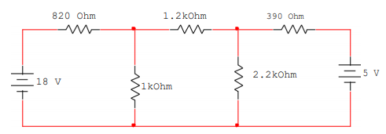

# Informe-3
#  ANÁLISIS DE NODOS.

## OBJETIVOS

Comprobar experimentalmente el Análisis de Nodos.

**Objetivos específicos:** 
 - Identificar las Mallas del circuito  
 -  Demostrar si se cumple el análisis de mallas tanto en los valores analíticos y en los
   simulados.     
 - Calcular las  corrientes en el circuito propuesto.   
 - Comprobar los resultados y los datos necesarios  del  circuito    
   propuesto, demostrando el análisis de mallas.    
 - Comparar los resultados obtenidos tanto del  análisis teórico como
   simulado y sacar conclusiones.
       
       
## MARCO TEÓRICO

El inicio de este estudio no puede darse si no se tiene el conocimiento necesario de las leyes de Kirchhoff tanto la de corriente como la de voltaje de la misma forma la ley de ohm, ya que estas son un pilar fundamental para el análisis de circuitos y ayudan con nuevos métodos que lo facilitan aún más como, en este caso, el análisis de mallas.

Antes de poder dar una definición de malla se debe conocer lo que es una trayectoria, trayectoria cerrada o lazo.

“Un punto en el cual dos o más elementos tienen una conexión común se llama nodo” (William H. Hayt, Kemmerly, & Durbin, 2012). Es una fácil definición de nodo, en otras palabras, es donde se conectan varios elementos.

“Si no encontramos un nodo más de una vez, entonces el conjunto de nodos y elementos a través de los cuales pasamos se define como una trayectoria” (William H. Hayt, Kemmerly, & Durbin, 2012). Para mejor entendimiento es el sentido que puede tomar un circuito. Claro pasando por los nodos correspondientes. La diferencia entre trayectoria y trayectoria cerrada es que esta ultima termina en el mismo lugar done comienza ya también se la conoce como lazo.

Ya con todo este conocimiento y junto a la ley de Kirchhoff de voltajes podemos dar inicio al conocimiento del análisis de mayas.

**Análisis de mallas**

Así como la ley de Kirchhoff de corriente se utiliza en los nodos para encontrar los valores que se necesitan, pues con la ley de voltajes de Kirchhoff se puede hacer algo muy parecido solo que en este en vez de utilizar nodos utilizamos lazos, y el hecho de hacer eso se lo conoce como Análisis de mallas, se tiene como restricción el poder hacerse solo en circuitos planos, pero comparado con el análisis de nodos este resulta mas complicado en determinados casos, se considera circuito plano el que al representarse en 2d no se superponen ramas, siempre se tienen que analizar bastante bien los circuitos porque a veces pueden parecer no planos y si serlo.

<section>
      

                   
   

   </section>
   
*Ilustración 1,Ejemplos de circuitos planos y no planos.*

“La malla es una propiedad de un circuito de forma plana y no se define para un circuito de forma no plana, sino como un lazo que no contiene ningún otro lazo dentro de él” (William H. Hayt, Kemmerly, & Durbin, 2012). Puede confundir un poco que significa una malla al principio pero viendo un grafico se entiende bien, que quiere decir que si una trayectoria cerrada tiene una rama dentro de él, entonces, no se considera una malla, en cambio si esta libre de cualquier elemento dentro de la trayectoria cerrada entonces si se puede llamar malla.

 <section>
      

                   
   

   </section>
   
*Ilustración 2, Circuito que no es y si es malla respectivamente.*

La forma de poder trabajar con las mallas es aplicando la LKV en dicha malla obteniendo ecuaciones para poder calcular los datos que nos falten, se puede hacer con todas las mallas y aplicar un sistema de ecuaciones para poder resolver las incógnitas. Al nombrar las mallas suelen acogerse al nombre de la intensidad de corriente que pasa por las ramas adyacentes.

# **DESCRIPCIÓN DE LOS EQUIPOS Y MATERIALES**

Descripción de los equipos y materiales**

**Fuente de voltaje C.D.** Es de donde conseguir electricidad para el circuito
<section>
      

                   
   

   </section> 
   
 *Ilustración 3, Fuente C.D*
   
**Multímetro digital**. Nos ayudara para poder hacer las mediciones de la practica

</section>
      

                   
   

   </section>

**Resistores** de 1kΩ, 2.2kΩ, 1.kΩ, 390Ω y 820Ω. Los utilizaremos para crear el circuito que vamos a medir

</section>
      

                   
   

   </section>

**Protoboard.** Es la base en la cual se va a formar el circuito con los elementos de este.
</section>
      

                   
   

   </section>
   

# **PROCEDIMIENTO**

Arme el circuito que se muestra en la figura 2.1.
</section>
      

                   
   

   </section>

Mida cada una de las corrientes de malla y anote los resultados en la tabla.  
Simule en el software Multisim, Proteus, o cualquier otro simulador, el circuito de la figura 2.1, obteniendo los valores de las corrientes de malla. Anote los resultados en la tabla 

***Tabla 2.1. Resultados obtenidos para el circuito de la figura 2.1.***
|MALLA       |RESULTADOS ANALÍTICOS| RESULTADOS SIMULADOS|
|------------|-----------------|---------------------|
|**Malla 1** |11.45[mA]        |11.5[mA]|
|**Malla 1** |2.84[mA]         |2.85[mA]|
|**Malla 1** |0.48[mA]         |0.488[mA]|

Verifique si se cumple la Ley de Kirchhoff de Voltajes en cada trayectoria cerrada, considerando las elevaciones de voltaje con signo positivo y las caídas de voltaje con signo negativo. Anote los resultados en la siguiente tabla.

## **DIAGRAMAS**
</section>
      

                   
   

   </section>
   
## **MAPA DE VARIABLES**

   **Resistores**: de 1(kΩ), 2.2(kΩ), 1.2(kΩ), 390(Ω) y 820(Ω). 
   
   **Fuentes**: de 18[V] y 5[V].
    
## **DESCRIPCIÓN**
Crear una cuenta de Tinkercad y generar la simulación de la practica 2

## **LISTA DE COMPONENTES**

 </section>
      

                   
   

   </section>
   

## **CONCLUSIONES**

Con esta práctica se pudo adquirir los conocimientos teóricos de lo que el abalisis de mallas,su tipo y su clasificación de acuerdo al circuito montado.

Deducimos según ley de Kirchhoff que expone que cuando en un circuito intervienen dos o más fuentes de voltaje, además de ramificaciones estamos en presencia de una red eléctrica. Para que resolvamos una red eléctrica es necesario realizar un proceso en el cual calculamos las intensidades de corrientes que circulan por cada malla.

Para el análisis completo de un circuito eléctrico requiere conocer la corriente que fluye en cada una de sus mallas para lo cual usamos la ley de volaje de Kirchhoff en las diferentes mallas y asi establecer ecuaciones que relacionan las direciones de corrientes que pasan por cada resistencia en las diferentes malla y asi podemos obtener las soluciones del sistema.

Con la ley de Kirchhoff de voltajes analiza lazos a diferencia de la ley de corriente ese analisis es concosido como anlisis de mallas.

Las leyes de Kirchhoff han sido una gran ayuda para la innovación tecnológica ya que han permitido medir con exactitud ciertas características eléctricas necesarias para que el invento funcione óptima mente.

## **RECOMENDACIONES**

Para mejorar un poco la forma de realizar los laboratorios, ayudaria el poder implementar un tiempo de desarrollo de las guias durante la hora de clase.

Para un comprension  total de todo lo impartido en fundamentos de circuitos electricos, las clases teoricas y los laboratorios podrian ir mas de la mano con los temas para que no existan confunciones a la hora de realizar cualquier tipo de actividad.

## **CRONOGRAMA**

 </section>
      

                   
   

   </section> 

  

# **BIBLIOGRÁFICA**

William H. Hayt, J., Kemmerly, J. E., & Durbin, S. M. (2012). Análisis de circuitos en ingenieria. Buffalo: Mc Graw Hill.

Ricárdez, A., Bastién Montoya, M., Hernández, B., & H. S., R. S. (2017). Estrategias para Resolver Problemas de Introducción a la Electrostática y Magnetostática. Ciudad de Mexico.

## **ANEXOS**

https://github.com/attoala/Informe-lab2/tree/master/anexos
