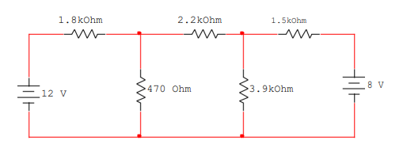
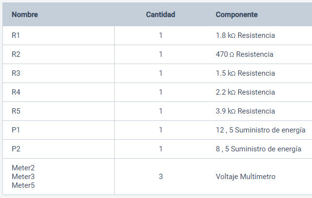

# Informe-3

#  ANÁLISIS DE NODOS.

## OBJETIVOS

Comprobar experimentalmente el Análisis de Nodos.

**Objetivos específicos:** 
 - Identificar los Nodos del circuito  
 -  Demostrar si se cumple el análisis de Nodos tanto en los valores analíticos y en los
   simulados.    
 - Comprobar los resultados y los datos necesarios  del  circuito    
   propuesto, demostrando el análisis de nodos.    
 - Comparar los resultados obtenidos tanto del  análisis teórico como
   simulado y sacar conclusiones.       
       
## MARCO TEÓRICO

Al igual que con el análisis de mallas del anterior laboratorio y también se requiere el conocer la ley de corrientes de Kirchhoff, de esta forma se puede dar con los resultados requeridos.

**Análisis de nodos**

La incógnita que se esa buscando aquí es la tensión de 2 nodos, “Se dejará que aumente el número de nodos y se proporcionará de manera correspondiente una cantidad desconocida adicional y una ecuación extra para cada nodo agregado.” (William H. Hayt, Kemmerly, & Durbin, 2012). Una forma de entender el análisis es que, por ejemplo, un circuito que tenga 3 nodos va a tener 2 tensiones las cuales no sabemos. De forma general un circuito que tenga N nodos  tendrá N-1 tensiones desconocidas y por ende N-1 ecuaciones para encontrarlas, cabe recalcar que estas ecuaciones se encuentran gracias a la ley de corrientes e Kirchhoff y para comenzar siempre se toma un nodo de referencia, normalmente el que esté con mas ramas.

<section>
      

                   
   

   </section>
   
*Ilustración 1,Ejemplos de circuitos planos y no planos.*

# **DESCRIPCIÓN DE LOS EQUIPOS Y MATERIALES**

Descripción de los equipos y materiales**

**Fuente de voltaje C.D.** Es de donde conseguir electricidad para el circuito
<section>
      

                   
   

   </section> 
   
 *Ilustración 1, Circuitos y sus nodo.*
   
**Multímetro digital**. Nos ayudara para poder hacer las mediciones de la practica

</section>
      

                   
   

   </section>

**Resistores** de 1.8(kΩ), 2.2(kΩ), 1.5(kΩ), 470(Ω) y 3.90(kΩ). Los utilizaremos para crear el circuito que vamos a medir

</section>
      

                   
   

   </section>

**Protoboard.** Es la base en la cual se va a formar el circuito con los elementos de este.
</section>
      

                   
   

   </section>
   

# **PROCEDIMIENTO**

Arme el circuito que se muestra en la figura 3.1.
</section>
      

                   
   

   </section>

Mida cada uno de los voltajes de nodo y anote los resultados en la tabla 3.1.
 3.5.3. Simule en el software Multisim, Proteus, o cualquier otro simulador, el circuito de la figura 3.1, obteniendo los valores de los voltajes de nodo. Anote los resultados en la tabla

***Tabla 3.1. Resultados obtenidos para el circuito de la figura 3.1.***
|NODO   |RESULTADOS ANALÍTICOS| RESULTADOS SIMULADOS|
|------------|-----------------|---------------------|
|**Nodo B**  |2.81[V]          |2.82[V]|
|**Nodo C**  |4.81[V]          |4.80[V]|
|**Nodo R**  |0[V]             |0[V]|

## **DIAGRAMAS**
</section>
      

                   
   

   </section>
   
## **MAPA DE VARIABLES**

   **Resistores**: de 1.8(kΩ), 2.2(kΩ), 1.5(kΩ), 470(Ω) y 3.90(kΩ). 
   
   **Fuentes**: de 12[V] y 8[V].
    
## **DESCRIPCIÓN**
Crear una cuenta de Tinkercad y generar la simulación de la practica 3

## **LISTA DE COMPONENTES**

 </section>
      

                   
   

   </section>
   

## **CONCLUSIONES**

Con esta práctica se pudo adquirir los conocimientos teóricos de lo que el abalisis de nodos,su tipo y su clasificación de acuerdo al circuito montado.

Deducimos según ley de Kirchhoff que expone que cuando en un circuito intervienen dos o más fuentes de voltaje, además de ramificaciones estamos en presencia de una red eléctrica. Para que resolvamos una red eléctrica es necesario realizar un proceso en el cual calculamos las tensiones que circulan por cada nodo.

El método del voltaje en los nodos es un método organizado para analizar un circuito, que está basado en la ley de Kirchhoff de la corriente.

Es muy importante conocer el flujo de corriente en un circuito electrico puesto que este analisis se basa en elflujo de corriente para poder plantear las ecuaciones basadas en las mismas.

Las leyes de Kirchhoff han sido una gran ayuda para la innovación tecnológica ya que han permitido medir con exactitud ciertas características eléctricas necesarias para que el invento funcione óptima mente.

## **RECOMENDACIONES**

Para mejorar un poco la forma de realizar los laboratorios, ayudaria el poder implementar un tiempo de desarrollo de las guias durante la hora de clase.

Para un comprension  total de todo lo impartido en fundamentos de circuitos electricos, las clases teoricas y los laboratorios podrian ir mas de la mano con los temas para que no existan confunciones a la hora de realizar cualquier tipo de actividad.

## **CRONOGRAMA**

 </section>
      

                   
   

   </section> 

  

# **BIBLIOGRÁFICA**

William H. Hayt, J., Kemmerly, J. E., & Durbin, S. M. (2012). Análisis de circuitos en ingenieria. Buffalo: Mc Graw Hill.

Ricárdez, A., Bastién Montoya, M., Hernández, B., & H. S., R. S. (2017). Estrategias para Resolver Problemas de Introducción a la Electrostática y Magnetostática. Ciudad de Mexico.

## **ANEXOS**

https://github.com/fernandoSando/Informe-3/tree/master/Anexos
